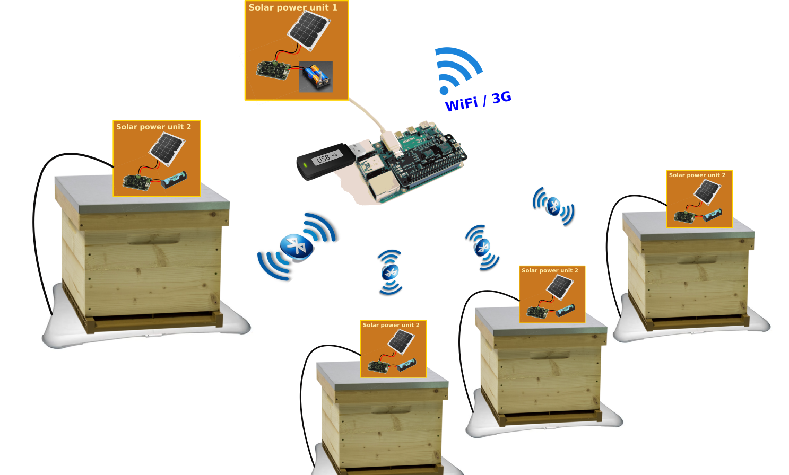

# WiiBee : Wireless connection for BeeHive timed weighing

## Overview

WiiBee is a low cost system to remotely measure the weigh evolution of your beehives. It is based on basic ideas :

1. Use cheap or used components 
2. Avoid wiring for better handling of the hives
3. Access to the measured data from anywhere
4. Group the measurements from several hives to one connected microcontroller unit
5. Energy self-sufficient

Manage beehives with RaspberryPi 3, Wii Fit Balance Board, a bluetooth relay and a WittyPi.

* https://www.uugear.com/product/witty-pi-3-mini-realtime-clock-and-power-management-for-raspberry-pi/
* https://www.leboncoin.fr/recherche?text=wii+balance

*[NOTE]* The **shutdown** command is located on the USB autorun script,
this way if you want to use the Raspberry, you can simply remove the USB drive,
you will have 5 minutes to login and disable schedule script with:
`sudo /home/pi/wittyPi/wittyPi.sh`

## Schematic diagram

It is composed of several connected scales placed under each hives and a Raspberry Pi that gathers all the measurements and send them to a external storage cloud. The system is then somewhat scalable depending on the bluetooth connection limits of the Raspberry. The elements (scales and microcontroller unit) are not wired together and are self-sufficient in energy (solar powered and/or battery).




## INSTALL

First, hardwire the bluetooth relay into each Wii Fit balance board : [wiiboard_wiring](wiiboard_wiring.md)

Individual 5V solar power supply units can be used for each Raspberry and Wii Balance Board :  [Solar_supply](Solar_supply.md)

Install WittyPi, see: https://www.uugear.com/product/witty-pi-3-mini-realtime-clock-and-power-management-for-raspberry-pi/
```
cd; wget http://www.uugear.com/repo/WittyPi3/install.sh
sudo sh install.sh
```

Then install wiibee (plug an empty USB (Ext4 formatted) stick in your Raspberry)
```
cd; wget https://raw.githubusercontent.com/galatgithub/Wiki-wiibee/main/install.sh
sudo sh install.sh
```

Edit `/mnt/bee1/wiibee/autorun.sh`, add the Bluetooth addresses of each Wii Fit 
balance board and the asscociated Bluetooth relay.

You can get the Bluetooth MAC addresses using `hcitool scan` or
`python /mnt/bee1/wiibee/wiiboard.py` after pressing the red sync button.

You can test opening and closing the relay with 
`sudo sh init_BT_relay.sh`

For GitHub integration, fork the wiibee repo, add a ssh key, edit the remote in
`/mnt/bee1/wiibee`, and setup GitHub pages:
* https://help.github.com/articles/generating-an-ssh-key/
* https://help.github.com/articles/configuring-a-publishing-source-for-github-pages/

## Remote connection
