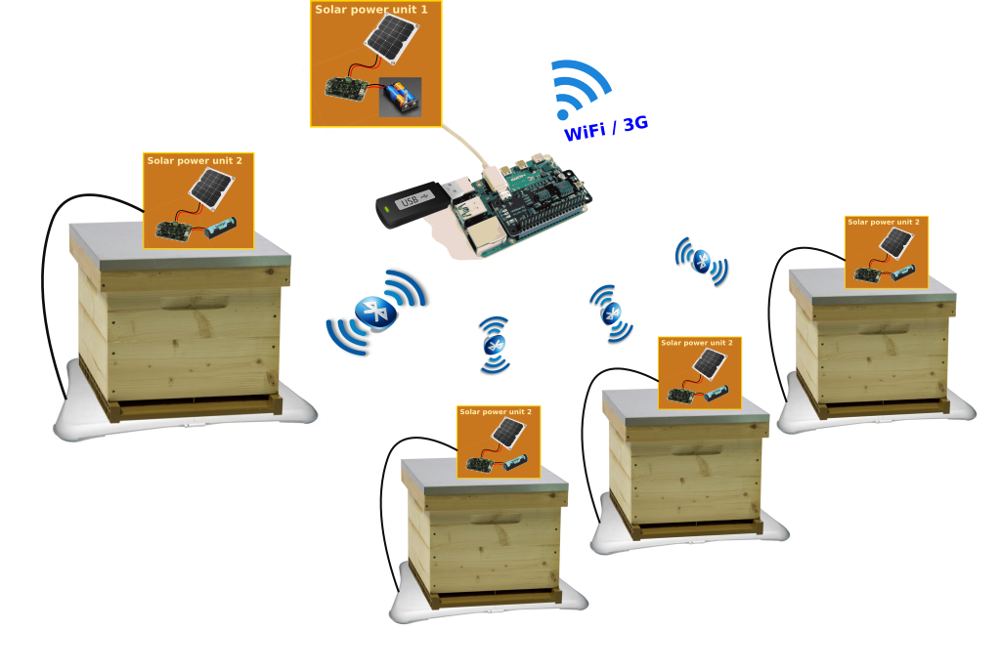

# WiiBee : Wireless connection for BeeHive timed weighing

## Overview

WiiBee is a low cost system to remotely measure the weigh evolution of your beehives. It is based on basic ideas :

1. Use cheap or used components 
2. Avoid wiring for better handling of the hives
3. Access to the measured data from anywhere
4. Group the measurements from several hives to one connected microcontroller unit
5. Energy self-sufficient

## Schematic diagram

It is composed of several connected scales placed under each hives and a Raspberry Pi that gathers all the measurements and send them to a external storage cloud. The system is then somewhat scalable depending on the bluetooth connection limits of the Raspberry. The elements (scales and microcontroller unit) are not wired together and are self-sufficient in energy (solar powered and/or battery).

