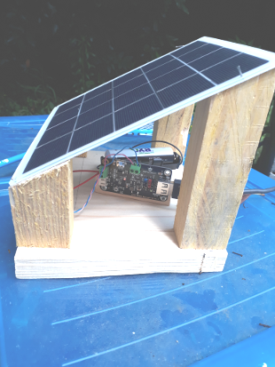

5V solar power supply
=====================

During a typical sequence : acquisition phase (2min) / standby (58min), the power consumption is :
- Raspberry Pi + WittyPi = 14mAh
- Wii balance board + Bluetooth relay = 5mAh

|        | Raspberry 3B | Wiiboard+BT relay |
| ------ | ------------ | ----------------- |
| in use |    400mA     |       150mA       |
| standby|    ~ 1mA     |        80µA       |

You need :
* Solar Power Manager 5V : [https://fr.aliexpress.com/item/4000094366617.html?spm=a2g0s.9042311.0.0.24206c372DiuRv](https://www.dfrobot.com/product-1712.html)
* 4/5W solar panel (output 4.4V-6V): https://www.cdiscount.com/maison/lampes/panneau-solaire-4w-5v-panneau-solaire-portatif-en/f-11702220701-auc9586491347295.html
* Batteries lithium-ion 18650 3.7V / 2600mAh : [1-meter USB Type A Female to Stripped Open Wire End Pigtail Cable](https://www.pearl.fr/article/ZX1791/4-batteries-lithium-ion-18650-3-7-v-2600-mah)
* Wired battery holder : https://fr.aliexpress.com/item/1005002777031870.html?spm=a2g0s.9042311.0.0.5c7e6c37MqZxFR
* USB Cable Type-A male > 2 x open wires power with sufficient length to connect the solar power supply to the Wii balance board or the Wittypi board

The solar panel / battery system is configured for 3 to 4 hours of sunlight per day and 5-days autonomy in case of bad weather.

One 3.7V / 2600mAh battery is sufficient for the full power autonomy of the Wii Balance Board / Bluetooth relay.

Two 3.7V / 2600mAh batteries are necessary for the Raspberry / Witty Pi.

The batteries and solar power manager fit in a waterproof electrical box (115x115x55mm) that can be set under the solar panel.
This assembly can easily fit onto the beehive roof :

<table>
        <tr>
            <td></td>
            <td></td>
        </tr>
</table>

TODO : some ways to minimize the power consumption of the Raspberry Pi : https://blues.io/blog/tips-tricks-optimizing-raspberry-pi-power/

[Back to README.md](README.md#INSTALL)

