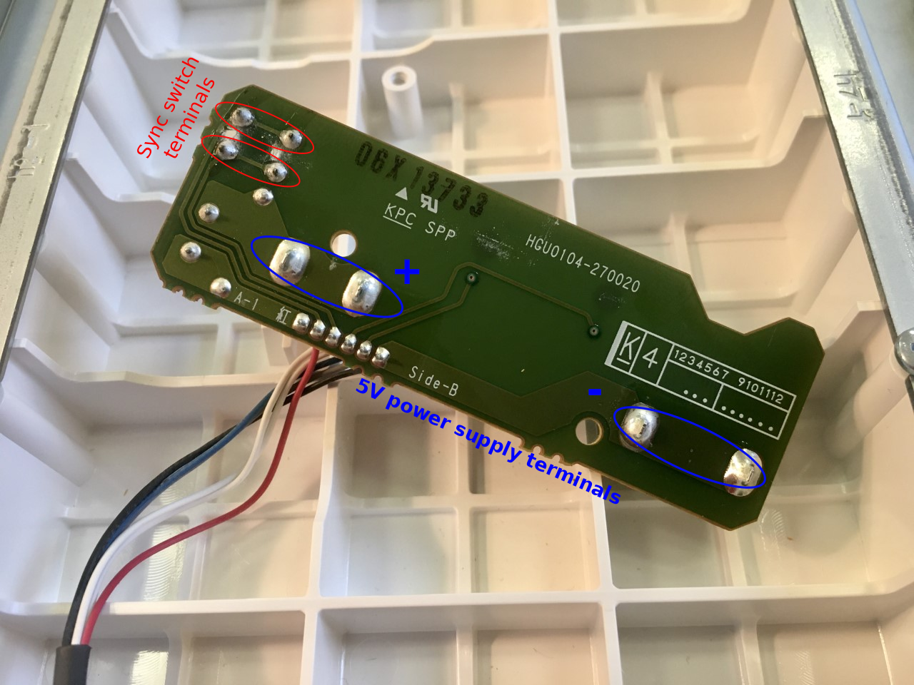
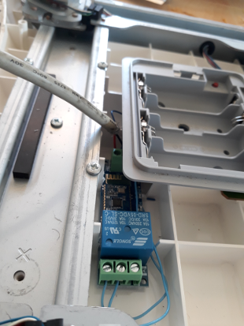

5V solar power supply
=====================

During a typical sequence : acquisition phase (2min) / standby (58min), the power consumption is :
- Raspberry Pi + WittyPi = 14mAh
- Wii balance board + Bluetooth relay = 5mAh

|        | Raspberry 3B | Wiiboard+BT relay |
| ------ | ------------ | ----------------- |
| in use |    400mA     |       150mA       |
| standby|    ~ 1mA     |        80µA       |

You need :
* Solar Power Manager 5V : [https://fr.aliexpress.com/item/4000094366617.html?spm=a2g0s.9042311.0.0.24206c372DiuRv](https://www.dfrobot.com/product-1712.html)
* 4/5W solar pannel (output 4.4V-6V): https://www.cdiscount.com/maison/lampes/panneau-solaire-4w-5v-panneau-solaire-portatif-en/f-11702220701-auc9586491347295.html
* Batteries lithium-ion 18650 3.7V / 2600mAh : [1-meter USB Type A Female to Stripped Open Wire End Pigtail Cable](https://www.pearl.fr/article/ZX1791/4-batteries-lithium-ion-18650-3-7-v-2600-mah)
* Wired battery holder : https://fr.aliexpress.com/item/1005002777031870.html?spm=a2g0s.9042311.0.0.5c7e6c37MqZxFR

The solar panel / battery system is configured for 3/4 hours of sunlight per day and 5-days autonomy in case of bad weather.

One 3.7V / 2600mAh battery is sufficient for the full power autonomy of the Wii Balance Board / Bluetooth relay.

Two 3.7V / 2600mAh batteries are necessary for the Raspberry / Witty Pi.

TODO : some ways to minimize the power consumption of the Raspberry Pi : https://blues.io/blog/tips-tricks-optimizing-raspberry-pi-power/

WIRING
------

- Disassemble Wii Balance Board Back Cover : https://www.ifixit.com/Guide/Wii+Balance+Board+Back+Cover+Replacement/30896
- Unscrew Wii Balance Board Battery Case

- On the backside of the board below the battery case, solder two wires on the soldering spots of the sync red button and two wires on soldering spots of the +/- power supply (Batteries terminals)

- Connect the sync button wires to the NO/comm of the relay
- Drill a hole in the Wii balance board backside cover nearby the battery case with the diameter of the USB cable
- Connect the Stripped Open Wire End of the USB cable together with the batteries terminals wires to supply terminals of the BT relay 

- The BT relay and cables can be inserted nearby the battery case by cutting some rigid plastic ribs of the board cap inside the board.
Place the relay as far as possible from metal parts to avoid disturbance of the BT signal 

<table>
        <tr>
            <td></td>
            <td></td>
            <td></td>
        </tr>
</table>

- Test the bluetooth relay with the script init_BT_relay.sh with its MAC address 

- Reassemble the balance Wii board

[Back to README.md](README.md#INSTALL)

