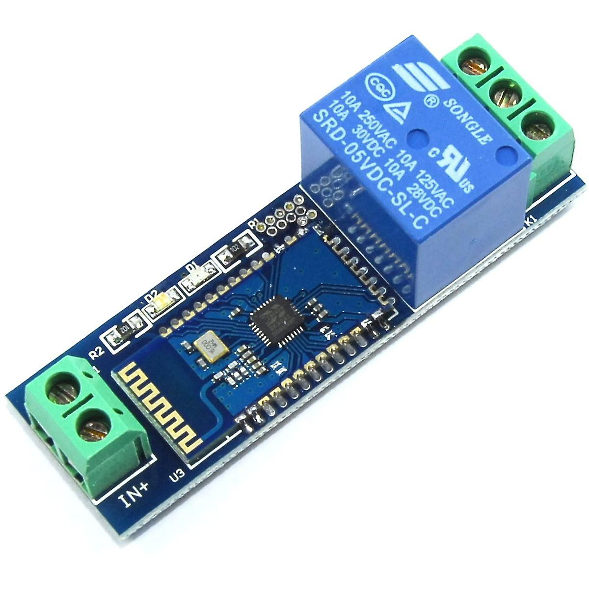
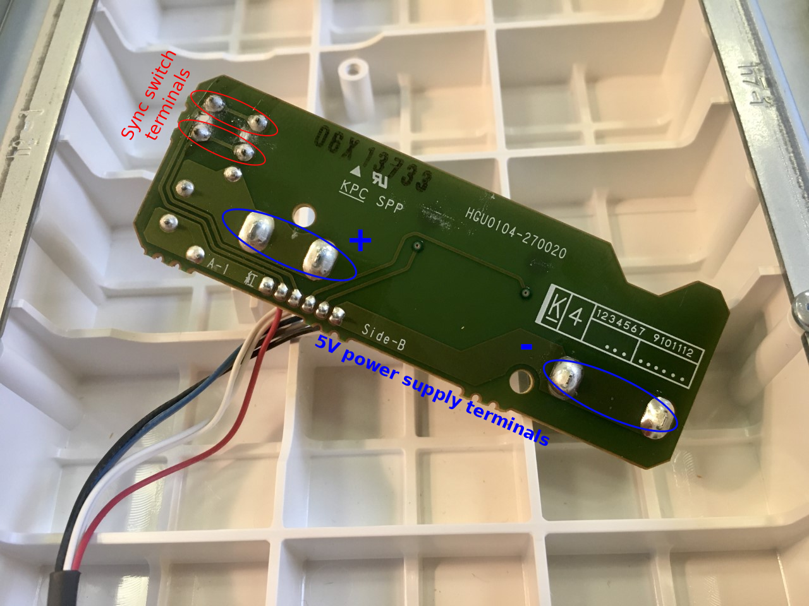
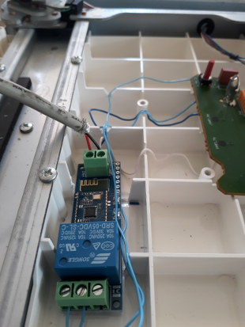
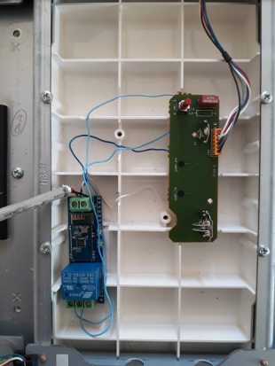
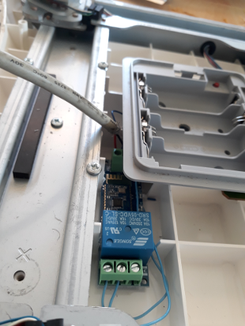

Bluetooth relay for Wii Fit Balance Board remote synchronisation
================================================================

You need :
* Single-channel bluetooth relay 5V : https://fr.aliexpress.com/item/4000094366617.html?spm=a2g0s.9042311.0.0.24206c372DiuRv

It looks like that :

* 0.5-mm diameter single round wire (as those in phone/ethernet cable)
* 1-meter USB Type A Female to Stripped Open Wire End Pigtail Cable

WIRING
------

- Disassemble Wii Balance Board Back Cover : https://www.ifixit.com/Guide/Wii+Balance+Board+Back+Cover+Replacement/30896
- Unscrew Wii Balance Board Battery Case

- On the backside of the board below the battery case, solder two wires on the pin ends of the sync red button and two wires on the +/- power supply (Batteries terminals)

- Connect the sync button wires to the NC/comm of the relay
- Drill a hole in the Wii balance board backside cover nearby the battery case with the diameter of the USB cable
- Connect the Stripped Open Wire End of the USB cable together with the batteries terminals wires to supply terminals of the BT relay 

- The BT relay and cables can be inserted nearby the battery case by cutting some rigid plastic ribs of the board cap inside the board.
Place the relay as far as possible from metal parts to avoid disturbance of the BT signal 

<table>
        <tr>
            <td></td>
            <td></td>
            <td></td>
        </tr>
</table>

- Test the bluetooth relay with the script init_BT_relay.sh with its MAC address 

- Reassemble the balance Wii board

[Back to README.md](README.md)
